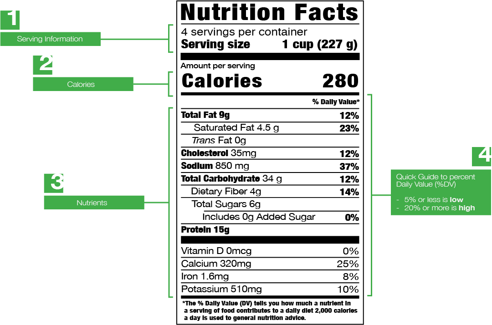

As of January 1, 2021, all food businesses were required to update their labels to reflect FDA’s new rules to increase font size of calories, identify amount of added sugars in sugar, and adjusted placement of vitamins, minerals, and some others.

# What is a nutrition label? 

This portion of the guide is designed to give you a better understanding of your overall nutritional requirements and help you make more mindful decision of what you eat everyday.

## 1. Serving Information
All the nutrient amounts shown on the label, including the number of calories, **refer to the size of the serving**. Pay attention to the serving size, especially how many servings there are in the food package.

## 2. Calories
A calorie is a unit of measurement defined as **the heat required to raise 1kg of water by 1 degree C**. In the body, calories are used to represent the potential energy within food. To achieve or maintain a healthy body weight try to balance the number of calories you eat (and drink) with the number of calories your body uses.

## 3. Nutrients 
Can be described as a substance that is **essential for the growth, development, and maintenance of the body**. They are often described in two broad types, macro- and micro- nutrients. 

## 4. Percent Daily Value (%DV)
The percentage of the Daily Value for each nutrient in a serving of the food. The Daily Values are **reference amounts (expressed in grams, milligrams, or micro-grams) of nutrients** to consume (or not exceed) per day.
