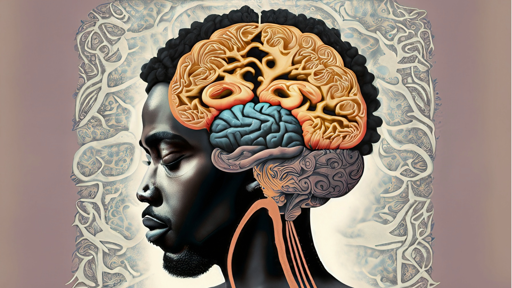

# 5 Compulsive States of Chitta

The Sanskrit words hold profound meanings within their sounds, and while translation into English might lose some essence, the following interpretations provide a close understanding.

> प्रमाणविपर्याविकल्पनिद्रास्मृतयः
	pramANaviparayavikalpanidrAsmRtayaH

**Pramana** `judgement`: Judgment involves direct experience, inference (connecting the dots), and acquisition (knowledge from elsewhere).

**Viparyaya** `misjudgment`: Misjudgment is illusory and false knowledge rooted in the misidentification of truth.

**Vikalpa** `imagination`: Imagination arises from knowing something at the surface without a complete picture.

**Nidra** `sleep`: Sleep is a cyclical activity of rest supported by the state of non-being.

**Smrti** `remembrance`: Remembrance involves retaining old experiences without letting them pass.

# Subtle States of Meditation

Patanjali elaborates on a calm and composed mind, defining it as free from compulsive thoughts and capable of perceiving consciousness within. This state results from spiritual reasoning, deep thought, pure bliss, and understanding the sense of 'I'.

He distinguishes two kinds of individuals: those who have lost the body due to wandering and those who have escaped the confines of "I" through constant "remembrance, equanimity, and pure perception."

> तीव्रसंवेगानमसाननः
	tIvrasanvegAnAmAsannaH

"It is easily attainable to those who approach it with a keen _resolve_." This **resolve**, or willingness to put effort into meditation, comes in three categories: Mild, Medium, and Intense.

Alternatively, one can be in **Ishwara** - a distinguished sense of self beyond the realms of klesha `(affliction)`, karma `(actions)`, vipaka `(results)`, and Ashaya `(intentions)`. Ishwara contains the seed of all knowledge, is the c**guru** `(illuminator)` of all who came before, and is known by the name of **pranava** `(the first sound)`.

Patanjali instructs chanting the mantra `pranava` repeatedly while contemplating its true meaning. This practice leads to the knowledge of individual consciousness and the absence of antaraya `obstacles`.

`Obstacles scatter the mind and include illness, procrastination, doubt, negligence, laziness, lack of discipline, conspiracies, and an inability to stay honest, humble, and of a growth mindset.`

Overcoming these obstacles brings a clear mind and pleasant feelings of friendliness, compassion, joy, and equanimity.

Despite mindfulness and meditation practices, maintaining a healthy chitta `mind` or a bright state of mind, free from sorrow and anguish and devoid of entanglement with the objects of the senses, is crucial. Seeking support in the knowledge of dreams and sleep states further enhances this state.

[Explore Yoga](../mental-health/spritualism/yoga/yoga.md)

[Dive into Hatha Yoga](../mental-health/spiritualism/yoga/hatha-yoga.md)

[Discover Kriya Yoga](../mental-health/spiritualism/yoga/kriya-yoga.md)

Read about the [Autobiography of a Yogi](./autobiography-of-a-yogi.md)
