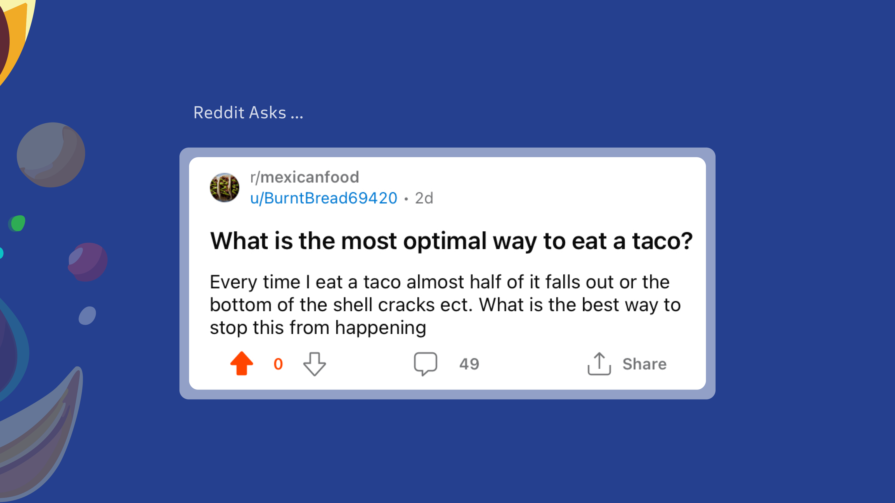
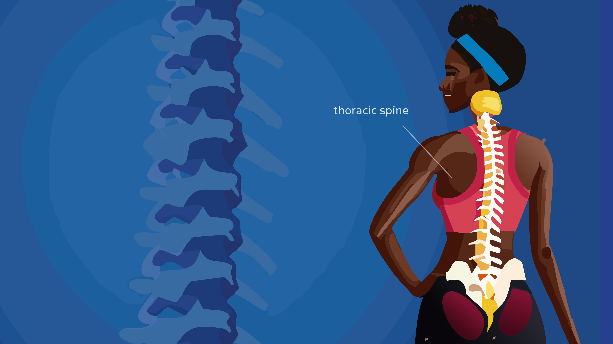

## We will cover:

[What Reddit asks](#the-question)

[Answering the best way to eat a taco](#the-answer)

[Extra tips about eating tacos like a pro](#the-extra) 

---

## <a id="the-question">The Question:</a> 

## <a id="the-answer">The Answer:</a> 

## <a id="the-extra">The Extra:</a>  
Its all about the **AoT , or angle of tilt**. More specifically, it has to do with the angle of taco tilt.

A lot of people don't know, but taco contents falling out is a direct result of poor shoulder mobility. 

In rare cases it can be related to thoracic spine mobility, but the large majority of cases have to do with shoulder mobility, or lack thereof.

Basically what happens is that when the shoulders become tight it can put additional strain on the surrounding muscles.

This then limits the rotation of the shoulder girdle, ultimately limiting the angle of tilt and making it impossible to enjoy a taco with peace of mind (or a clean shirt). 

Because of this, you're going to need to improve your shoulder mobility. 

## The best way I have found to do this is with an exercise called Taco Shell Circles.

To perform this exercise you will need an empty taco shell, and hold it with an outstretched arm. 

From here you can begin to do circles forwards for 8-10 reps, and then backwards for another 8-10 reps, making sure to make smooth and strong rotations. 

If you do this consistently (like roughly 4-5 times per week) you should begin see that your taco contents remain in position throughout your meal.

## One last thing...

Keep in mind that none of this applies if you have overly flexible shoulders.  

In these extremely rare cases, one may require a professional guard, such as a napkin, to reduce the likelihood of taco contents spreading. 

And remember, always check with your primary taco shell dealer before trying any new taco exercises. 

## Back: [part 1 of answering your Reddit questions](./how-to-meditate-still.md).
## Next: [part 3 of answering your Reddit questions](./how-to-eat-a-taco.md).

