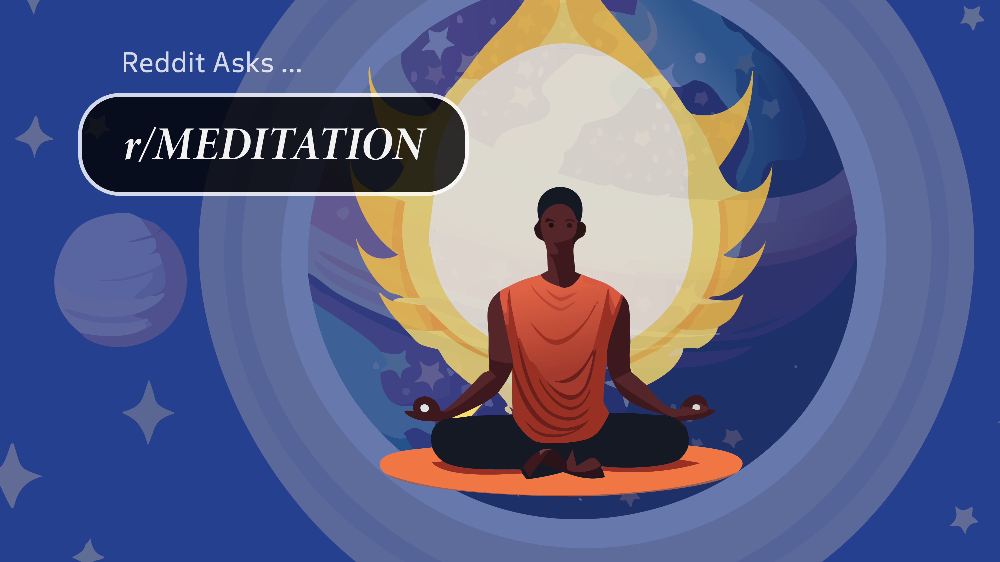
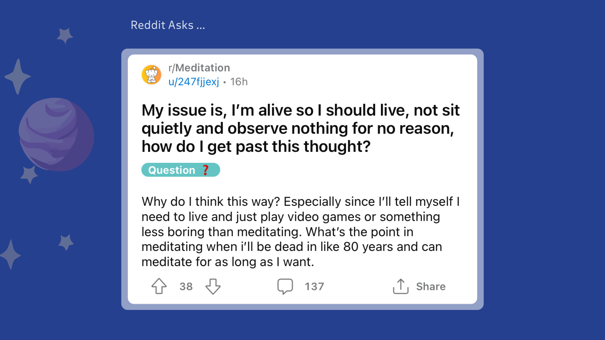

## We will cover:

[The Question](#the-question)

[The Answer](#the-answer)

[The Extra](#the-extra) 

## <a name="the-question">The Question:</a> 

## <a name="the-answer">The Answer:</a> 

## <a name="the-extra">The Extra:</a>  

In the book "Stillness is the key", author Ryan Holiday stresses the point that "when all of the ancient world agrees on something only a fool wouldn't listen". 

The benefits of practicing stillness, sitting with ones own thoughts, and questioning our own actions have been the antagonist to some of the worlds greatest achievements.

Simply look back to history's most legendary figures, like Winston Churchill or Aristotle, and its easy to find examples where the ability to sit with ones own thoughts and emotions gave rise to simple to solutions in complex situations. 

### The history of meditation dates back to original Sanskrit texts carved into stone tablets some thousands of years ago. 

But because many of today meditations are adaptations of traditional Buddist practices, its important to look through the lens of a Buddhist monk when seeking to understanding what meditation really is.

In Buddhism, stillness is the key. 

It is believed that our spirit (or life force, or energy, or however you would like to think about it) is unique to us as individuals. 

The reason for this is simple. By being born we have been granted the greatest gift of all — the gift of being human.

Humans, by nature, are different from animals. In Buddhism this is enough of a reason to practice what is uniquely human; **the ability to foster a strong mental and emotional resilience.**

Many who practice the religion of Buddhism believe a constant practice of meditation is required in order to move into a higher state of consciousness and into a better afterlife.

## The takeaway is this...

Through a regular practice of mindfulness meditation we awaken a deeper state of conscious inside ourselves.

A state which is not only unique to us individually, but unique to our soul and what we seek in our existence.

I personally believe that this realization (which really can only be achieved through a meditative state of mind) is what allows people to be smarter, wiser, and less impulsive.

Learn more about [what meditation is, the history of it, and how to practice](https://www.yudaewellness.com/post/meditation-meaning).

## Jump to [part 2 of answering your Reddit questions](./how-to-eat-a-taco.md).

